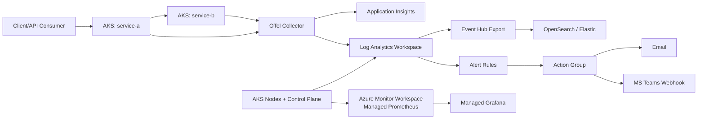

# OmniScope Cloud

**Azure observability reference** — architecture documentation, parallel Infrastructure-as-Code (Bicep, Terraform, Pulumi), and **sample workloads for AKS** (Go microservices + OpenTelemetry Collector + Jaeger in-cluster).

---

## Highlights

| Area | What you get |
|------|----------------|
| **Architecture** | End-to-end observability design for Azure (metrics, logs, traces, Grafana, alerting, IaC narrative) in [`doc-site/`](./doc-site/). |
| **Infrastructure** | Minimal **test** baseline: Resource Group, Log Analytics, Application Insights (linked to LAW), Action Group — optional **AKS**, optional **ACR** with **AcrPull** for the cluster kubelet. Implementations: [`infra/bicep/`](./infra/bicep/), [`infra/terraform/`](./infra/terraform/), [`infra/pulumi/`](./infra/pulumi/). |
| **Examples** | Go services built as container images, pushed to **ACR**, deployed with **Kubernetes** manifests on **AKS** — see [`examples/`](./examples/) and [`examples/docs/AKS-ACR-CICD.md`](./examples/docs/AKS-ACR-CICD.md). |

---

## Repository layout

```text
OmniScope_Cloud/
├── doc-site/           # VitePress docs (config + Markdown)
├── examples/           # Dockerfiles + kubernetes/ for AKS (+ ACR / CI/CD notes)
├── infra/
│   ├── bicep/          # ARM/Bicep (optional AKS + ACR attach)
│   ├── pulumi/         # Pulumi (TypeScript)
│   ├── terraform/      # Terraform (azurerm)
│   └── README.md       # Shared parameters & extension ideas
├── CONTRIBUTING.md
├── LICENSE
└── README.md
```

---

## Quick start

### AKS + ACR (examples)

1. Deploy baseline with Bicep (includes AKS + ACR + kubelet **AcrPull** when defaults are used).
2. Build and push images, apply manifests — full flow: [`examples/README.md`](./examples/README.md) and [`examples/docs/AKS-ACR-CICD.md`](./examples/docs/AKS-ACR-CICD.md).
3. One-command full flow (infra + apps + smoke): [`scripts/deploy-project.sh`](./scripts/deploy-project.sh) with [`.env.deploy.example`](./.env.deploy.example). **Loki-only** logs (Loki + Promtail + **Azure Managed Grafana**, no Jaeger/Collector): `OBSERVABILITY_LOKI_ONLY=true` and `DEPLOY_MANAGED_PROMETHEUS=true` — see [`examples/README.md`](./examples/README.md).
4. Optional in-cluster Alertmanager deploy: [`examples/kubernetes/alertmanager/`](./examples/kubernetes/alertmanager/) + [`scripts/create-alertmanager-secret.sh`](./scripts/create-alertmanager-secret.sh).

### Azure baseline (Bicep)

Prerequisites: **Azure CLI**, `az login`. Example deployment at subscription scope:

```bash
cd infra/bicep
az deployment sub create \
  --location westeurope \
  --template-file ./main.bicep \
  --parameters \
    prefix="omniscope-obs-test" \
    alertEmail="oncall@example.com"
```

To deploy **AKS without** a new registry (bring your own ACR or public images only): set `deployAcr=false`. Parameter reference: [`infra/bicep/README.md`](./infra/bicep/README.md). Terraform and Pulumi equivalents live under [`infra/terraform/`](./infra/terraform/) and [`infra/pulumi/`](./infra/pulumi/); shared concepts are in [`infra/README.md`](./infra/README.md).

## OmniScope Observability Architecture



- Rebuilt documentation entrypoint: [`docs/README.md`](./docs/README.md)
- Project story (philosophy + implementation narrative): [`docs/PROJECT_STORY.md`](./docs/PROJECT_STORY.md)
- Future project vision (goals + roadmap): [`docs/PROJECT_VISION.md`](./docs/PROJECT_VISION.md)
- Project execution plan 30/60/90 (KPI + risks + milestones): [`docs/PROJECT_PLAN_30_60_90.md`](./docs/PROJECT_PLAN_30_60_90.md)
- Load test + Service Mesh validation checklist: [`docs/LOAD_TEST_AND_SERVICE_MESH_VALIDATION.md`](./docs/LOAD_TEST_AND_SERVICE_MESH_VALIDATION.md)
- k6 baseline script: [`tests/load/k6-omniscope.js`](./tests/load/k6-omniscope.js)
- Load-test baseline policy: [`docs/LOAD_TEST_BASELINE.md`](./docs/LOAD_TEST_BASELINE.md)
- Deployment runbook (`create -> deploy -> verify -> cleanup`): [`docs/DEPLOYMENT_RUNBOOK.md`](./docs/DEPLOYMENT_RUNBOOK.md)
- Evidence and screenshot checklist: [`docs/EVIDENCE.md`](./docs/EVIDENCE.md)
- Grafana dashboards:
  - [`docs/grafana-dashboard.json`](./docs/grafana-dashboard.json) (OmniScope Baseline)
  - [`docs/grafana-alerting-dashboard.json`](./docs/grafana-alerting-dashboard.json) (OmniScope Alerting)
  - [`docs/grafana-platform-health-dashboard.json`](./docs/grafana-platform-health-dashboard.json) (OmniScope Platform Health)
  - [`docs/grafana-dashboard0.json`](./docs/grafana-dashboard0.json) (OmniScope NOC Loki)

### Documentation site

**Live docs (GitHub Pages):** [https://audit-kwazar-0.github.io/OmniScope_Cloud/](https://audit-kwazar-0.github.io/OmniScope_Cloud/)

Sources live under [`doc-site/`](./doc-site/) (VitePress). **Local preview:**

```bash
cd doc-site
npm ci
npm run docs:dev
```

**GitHub Pages** (Settings → Pages → **Source: GitHub Actions**): workflow [`.github/workflows/deploy-docs.yml`](./.github/workflows/deploy-docs.yml) builds on every push to `main` when `doc-site/`, root `README.md`, or the workflow changes. For **project** Pages the URL is `https://<owner>.github.io/<repository>/` (this repo: link above). For a **user** site (`<user>.github.io` only) set `VITEPRESS_BASE: /` and adjust `DOCS_PUBLIC_URL` in the workflow.

**Sync with this README:** the guide page [`repository-readme`](./doc-site/guide/repository-readme.md) is regenerated from the root **README.md** by `doc-site/scripts/sync-readme.mjs` before `docs:dev` / `docs:build` (relative links are rewritten to `github.com/<repo>/blob/main/...` when `GITHUB_REPOSITORY` or `git remote` is available). Edit **README.md** here; do not hand-edit the generated page.

---

## GitHub

Suggested **repository description**:

> Azure observability reference: VitePress docs, parallel IaC (Bicep / Terraform / Pulumi), AKS + ACR sample apps with OpenTelemetry.

Suggested **topics**: `azure`, `observability`, `opentelemetry`, `application-insights`, `log-analytics`, `bicep`, `terraform`, `pulumi`, `aks`, `azure-container-registry`, `kubernetes`, `vitepress`.

---

## Contributing

We welcome issues and pull requests. Please read [`CONTRIBUTING.md`](./CONTRIBUTING.md) before submitting changes.

---

## License

This project is released under the [MIT License](./LICENSE).
