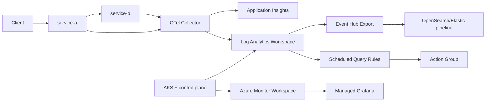

# Обзор платформы

Документация построена по текущей реализации в репозитории `OmniScope_Cloud`.

## Что разворачивается

- AKS (Azure CNI overlay, VNet/subnets)
- Log Analytics Workspace + Application Insights
- Azure Monitor Workspace (Managed Prometheus) + Managed Grafana
- Event Hub + LAW Data Export (путь в OpenSearch/Elastic pipeline)
- Alert rules + Action Group
- ACR + AcrPull для AKS kubelet
- Контрольные workload'ы в AKS (`service-a`, `service-b`, OTel collector, Jaeger)

## Поток данных

## Где смотреть в коде

- IaC entry: `infra/bicep/main.bicep`
- Bicep modules: `infra/bicep/modules/*`
- App manifests: `examples/kubernetes/*`
- Services: `examples/services/service-a`, `examples/services/service-b`
