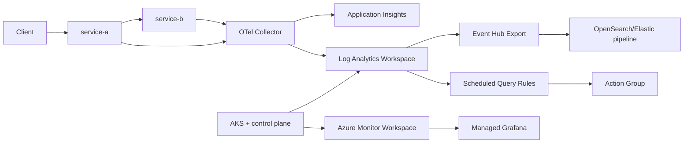

# Platform overview

Documentation reflects the current implementation in the `OmniScope_Cloud` repository.

## What gets deployed

- AKS (Azure CNI overlay, VNet/subnets)
- Log Analytics Workspace + Application Insights
- Azure Monitor Workspace (Managed Prometheus) + Managed Grafana
- Event Hub + LAW Data Export (path to OpenSearch/Elastic pipeline)
- Alert rules + Action Group
- ACR + AcrPull for the AKS kubelet
- Reference workloads in AKS (`service-a`, `service-b`, OTel collector, Jaeger)

## Data flow

## Where to look in the repo

- IaC entry: `infra/bicep/main.bicep`
- Bicep modules: `infra/bicep/modules/*`
- App manifests: `examples/kubernetes/*`
- Services: `examples/services/service-a`, `examples/services/service-b`
